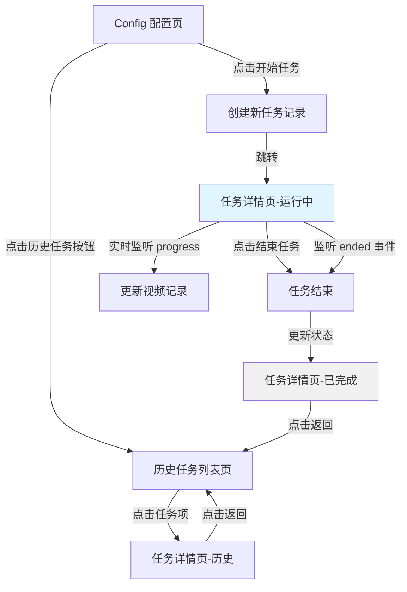
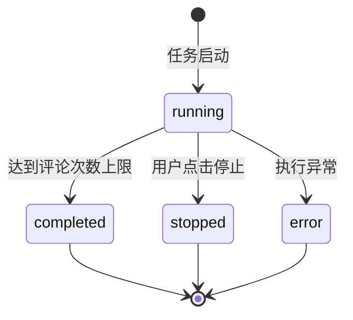

# 历史任务列表功能设计

## 功能概述

为 feed-ac-tasks 功能添加历史任务记录与详情查看能力，帮助用户复盘任务执行效果，分析评论成功率和视频互动情况。

## 核心需求

### 1. 历史任务入口

- 在 feed-ac-tasks/config 页面左上角新增"历史任务"按钮
- 点击按钮导航至历史任务列表页面

### 2. 历史任务列表页

展示最近 10 条任务记录，每条记录包含：

- 任务开始时间
- 任务结束时间
- 评论成功次数
- 任务执行状态：成功完成、手动停止、异常错误
- 失败原因描述（若失败）

支持点击任务项进入任务详情页

### 3. 任务详情页

展示单个任务的完整执行信息：

**视频观看记录列表**

- 视频作者昵称
- 视频描述文本
- 视频标签列表
- 视频链接（share_url）
- 观看时长（毫秒转换为秒显示）
- 是否已评论
- 评论内容（若已评论）
- 未评论原因（若未评论）

**筛选功能**

- 提供"全部"、"已评论"两种筛选选项
- 默认展示全部视频记录

**运行中任务特殊处理**

- 实时刷新任务状态和视频列表
- 展示运行日志流
- 提供"结束任务"按钮

**页面导航**

- 提供返回按钮回到历史列表页

### 4. 任务启动流程调整

- 移除当前"开始任务后页面切换到运行中状态"的逻辑
- 点击"开始任务"按钮后直接跳转到当前运行任务的详情页
- 开始任务按钮变为禁用状态
- 鼠标悬停时提示："任务正在运行，请等待前一个任务结束"

## 数据结构设计

### TaskHistoryRecord（任务历史记录）

| 字段名       | 类型                | 说明                                         |
| ------------ | ------------------- | -------------------------------------------- |
| id           | string              | 任务唯一标识，使用 nanoid 生成               |
| startTime    | number              | 任务开始时间戳（毫秒）                       |
| endTime      | number \| null      | 任务结束时间戳，运行中为 null                |
| status       | TaskStatus          | 任务状态：running、completed、stopped、error |
| errorMessage | string \| undefined | 错误信息，status 为 error 时必填             |
| commentCount | number              | 成功评论次数                                 |
| videoRecords | VideoRecord[]       | 视频观看记录列表                             |
| settings     | FeedAcSettingsV2    | 任务使用的配置快照                           |

### VideoRecord（视频观看记录）

| 字段名        | 类型                | 说明                     |
| ------------- | ------------------- | ------------------------ |
| videoId       | string              | 视频唯一标识             |
| authorName    | string              | 视频作者昵称             |
| videoDesc     | string              | 视频描述                 |
| videoTags     | string[]            | 视频标签列表             |
| shareUrl      | string              | 视频分享链接             |
| watchDuration | number              | 观看时长（毫秒）         |
| isCommented   | boolean             | 是否已评论               |
| commentText   | string \| undefined | 评论内容，已评论时必填   |
| skipReason    | string \| undefined | 未评论原因，未评论时必填 |
| timestamp     | number              | 记录时间戳（毫秒）       |

### TaskStatus（任务状态枚举）

| 状态值    | 说明         |
| --------- | ------------ |
| running   | 任务运行中   |
| completed | 任务成功完成 |
| stopped   | 用户手动停止 |
| error     | 任务执行异常 |

## 数据持久化方案

使用 electron-store 存储任务历史数据

**存储键名**

- `task-history-records`: 存储任务历史记录数组

**存储策略**

- 最多保留最近 10 条任务记录
- 新任务创建时，若超过 10 条则删除最旧的记录
- 任务记录按 startTime 倒序排列

**数据访问位置**

- 主进程：负责创建、更新任务记录
- 渲染进程：通过 IPC 接口读取任务历史数据

## 页面路由设计

新增两个路由：

### 历史任务列表页

- 路由路径：`/tools/feed-ac-tasks/history`
- 路由名称：`feedAcTasksHistory`
- 组件路径：`pages/feed-ac-tasks/history/index.vue`

### 任务详情页

- 路由路径：`/tools/feed-ac-tasks/detail/:taskId`
- 路由名称：`feedAcTasksDetail`
- 组件路径：`pages/feed-ac-tasks/detail/index.vue`
- 路由参数：`taskId` - 任务记录的唯一标识

## IPC 接口设计

### taskHistory:getList

获取任务历史记录列表

**请求参数**：无

**返回数据**

```
TaskHistoryRecord[]
```

### taskHistory:getDetail

获取指定任务的详细信息

**请求参数**

- taskId: string - 任务ID

**返回数据**

```
TaskHistoryRecord | null
```

### taskHistory:delete

删除指定任务记录

**请求参数**

- taskId: string - 任务ID

**返回数据**

```
{ ok: boolean; message?: string }
```

### taskHistory:getCurrentRunningTask

获取当前正在运行的任务（若存在）

**请求参数**：无

**返回数据**

```
TaskHistoryRecord | null
```

## 主进程任务记录逻辑

### 任务生命周期钩子

**任务启动时**

1. 创建新的 TaskHistoryRecord 对象
2. 设置 status 为 running
3. 记录 startTime
4. 保存配置快照到 settings 字段
5. 存储到 electron-store

**任务执行过程中**

1. 监听每个视频处理事件
2. 创建对应的 VideoRecord 对象
3. 更新当前任务记录的 videoRecords 数组
4. 实时更新 commentCount
5. 持久化更新后的任务记录

**任务结束时**

1. 设置 endTime 为当前时间戳
2. 根据结束原因更新 status：
   - 正常完成 → completed
   - 用户主动停止 → stopped
   - 捕获到异常 → error（记录 errorMessage）
3. 持久化最终状态

### 视频记录采集时机

在 ACTask 工作流中，针对每个处理的视频创建 VideoRecord：

| 场景       | 采集时机         | isCommented | skipReason 示例        |
| ---------- | ---------------- | ----------- | ---------------------- |
| 成功评论   | 评论发送成功后   | true        | -                      |
| 评论失败   | 评论尝试失败后   | false       | "评论发布接口返回错误" |
| 活跃度不足 | 活跃度检查失败后 | false       | "视频活跃度不符合标准" |
| 命中屏蔽词 | 屏蔽词检查时     | false       | "命中屏蔽关键词"       |
| 规则不匹配 | 规则匹配检查后   | false       | "不满足评论规则"       |
| 非常规视频 | 视频类型检查后   | false       | "非常规视频类型"       |

**视频数据提取来源**

- authorName：从 `videoInfo.author.nickname` 获取
- videoDesc：从 `videoInfo.desc` 获取
- videoTags：从 `videoInfo.video_tag` 数组提取 `tag_name` 字段
- shareUrl：从 `videoInfo.share_url` 获取
- watchDuration：记录从视频开始播放到跳转下一个视频的时间差

## 前端组件设计

### 历史任务列表页组件结构

**主组件**：`pages/feed-ac-tasks/history/index.vue`

**子组件**

- `TaskListItem.vue` - 任务记录卡片组件
  - 展示单条任务的摘要信息
  - 提供点击跳转详情功能
  - 根据 status 显示不同的状态徽章

**状态管理**

- 使用 Pinia Store：`stores/history.ts`
- 维护任务列表数据
- 提供加载、删除任务方法

### 任务详情页组件结构

**主组件**：`pages/feed-ac-tasks/detail/index.vue`

**子组件**

- `VideoRecordList.vue` - 视频记录列表组件
  - 展示视频观看记录表格
  - 支持筛选功能切换
  - 显示评论状态徽章
- `TaskDetailHeader.vue` - 详情页头部组件
  - 显示任务基本信息（开始时间、结束时间、状态）
  - 提供返回按钮
  - 运行中任务显示"结束任务"按钮
- `RunningTaskLogs.vue` - 运行日志组件（仅运行中任务）
  - 实时展示任务日志
  - 复用现有 TaskLogs 组件逻辑

**状态管理**

- 扩展现有 `stores/task.ts`
- 新增获取任务详情方法
- 监听 task:progress 事件实时更新运行中任务

### Config 页面改动

**文件**：`pages/feed-ac-tasks/config/index.vue`

**改动点**

1. 左上角区域新增"历史任务"按钮
2. 按钮布局：历史任务按钮 | 配置管理下拉菜单 | 开始任务按钮
3. 点击"历史任务"按钮导航至 `/tools/feed-ac-tasks/history`

**StartButton 组件改动**

**文件**：`pages/feed-ac-tasks/config/components/StartButton.vue`

**改动点**

1. 点击"开始任务"成功后，跳转到任务详情页
2. 获取当前运行任务的 taskId，导航至 `/tools/feed-ac-tasks/detail/${taskId}`
3. 任务运行中时，按钮禁用并显示悬停提示
4. 删除原有页面状态切换逻辑（移除运行中状态的条件渲染）

## 实时更新机制

### 运行中任务的实时同步

**渲染进程监听**

- 监听 `task:progress` 事件
- 每次事件触发时：
  1. 调用 IPC 接口获取最新任务数据
  2. 更新 Pinia Store 中的任务详情
  3. 触发视频列表和日志的重新渲染

**主进程推送**

- 每次创建 VideoRecord 后，通过 `task:progress` 事件通知渲染进程
- 携带进度类型标识，便于前端区分不同事件

### 任务结束后的状态同步

监听 `task:ended` 事件：

- 更新任务状态为最终状态
- 刷新任务详情页数据
- 若在详情页，保持页面展示最终结果

## 交互流程图



## 任务记录状态流转



## 文件变更清单

### 新增文件

**类型定义**

- `src/shared/task-history.ts` - 任务历史相关类型定义

**主进程**

- `src/main/ipc/task-history.ts` - 任务历史 IPC 接口实现
- `src/main/service/task-history/index.ts` - 任务历史服务层
- `src/main/service/task-history/storage.ts` - 任务历史存储管理

**渲染进程**

- `src/renderer/src/pages/feed-ac-tasks/history/index.vue` - 历史列表页
- `src/renderer/src/pages/feed-ac-tasks/history/components/TaskListItem.vue` - 任务列表项组件
- `src/renderer/src/pages/feed-ac-tasks/detail/index.vue` - 任务详情页
- `src/renderer/src/pages/feed-ac-tasks/detail/components/VideoRecordList.vue` - 视频记录列表
- `src/renderer/src/pages/feed-ac-tasks/detail/components/TaskDetailHeader.vue` - 详情头部
- `src/renderer/src/pages/feed-ac-tasks/detail/components/RunningTaskLogs.vue` - 运行日志
- `src/renderer/src/pages/feed-ac-tasks/stores/history.ts` - 历史任务 Store

### 修改文件

**主进程**

- `src/main/workflows/feed-ac/index.ts` - ACTask 工作流
  - 新增任务记录创建逻辑
  - 新增视频记录采集逻辑
  - 新增任务结束时状态更新
- `src/main/ipc/task.ts` - 任务 IPC 接口
  - 启动任务时创建历史记录并返回 taskId
  - 任务结束时更新历史记录状态
- `src/main/index.ts` - 主进程入口
  - 注册 taskHistory IPC 接口

**渲染进程**

- `src/preload/index.ts` - Preload 脚本
  - 暴露任务历史相关 API

- `src/preload/index.d.ts` - Preload 类型定义
  - 新增任务历史 API 类型声明

- `src/renderer/src/router/index.ts` - 路由配置
  - 新增历史列表页路由
  - 新增任务详情页路由

- `src/renderer/src/pages/feed-ac-tasks/config/index.vue` - 配置页
  - 新增历史任务按钮

- `src/renderer/src/pages/feed-ac-tasks/config/components/StartButton.vue` - 开始按钮
  - 修改点击行为，跳转到详情页
  - 新增禁用状态提示逻辑

- `src/renderer/src/pages/feed-ac-tasks/config/stores/task.ts` - 任务 Store
  - 新增获取当前运行任务 ID 的方法
  - 新增任务详情数据管理

## 技术实现要点

### 1. 视频观看时长计算

在 ACTask 工作流中：

- 每个视频开始处理时记录开始时间戳
- 跳转下一个视频前记录结束时间戳
- 计算差值作为 watchDuration

### 2. 任务配置快照

任务启动时深拷贝当前 FeedAcSettingsV2 对象存储到任务记录，避免后续配置变更影响历史记录的准确性

### 3. 并发任务控制

通过主进程维护全局 running 标志位，确保同一时间只有一个任务在执行，防止多任务冲突

### 4. 历史记录清理策略

每次新增任务时检查记录总数：

- 若记录数 >= 10，删除 startTime 最早的记录
- 保持数组按 startTime 倒序排列

### 5. 运行中任务唯一性

通过 status 字段查询：

- 同一时间最多只有一个 status 为 running 的任务
- 应用启动时检查是否有遗留的 running 状态任务，自动修正为 error 状态

## 边界场景处理

### 1. 应用异常关闭

- 启动时扫描任务历史，将所有 running 状态改为 error
- errorMessage 设置为 "应用异常关闭，任务未正常结束"

### 2. 任务详情页刷新

- 通过路由参数 taskId 重新加载任务数据
- 若 taskId 对应的任务不存在，显示空状态提示

### 3. 历史记录为空

- 列表页显示空状态占位图
- 提示用户"暂无任务历史记录"

### 4. 运行中任务强制刷新页面

- 监听 task:progress 事件会重新绑定
- 通过 getCurrentRunningTask 接口恢复任务数据

### 5. 视频信息获取失败

- VideoRecord 中对应字段填充默认值
- authorName、videoDesc 填充 "未知"
- videoTags 填充空数组
- shareUrl 填充空字符串

## 用户体验优化

### 1. 时间展示格式

- 开始时间、结束时间显示为：`YYYY-MM-DD HH:mm:ss`
- 观看时长显示为：`X.X 秒`（保留一位小数）

### 2. 状态徽章颜色

- running：蓝色
- completed：绿色
- stopped：灰色
- error：红色

### 3. 筛选功能默认状态

- 默认选中"全部"
- 切换筛选时保持滚动位置

### 4. 加载状态

- 列表加载时显示骨架屏
- 详情加载时显示加载中提示

### 5. 错误提示

- 删除任务失败时弹出错误消息
- 加载数据失败时显示重试按钮
